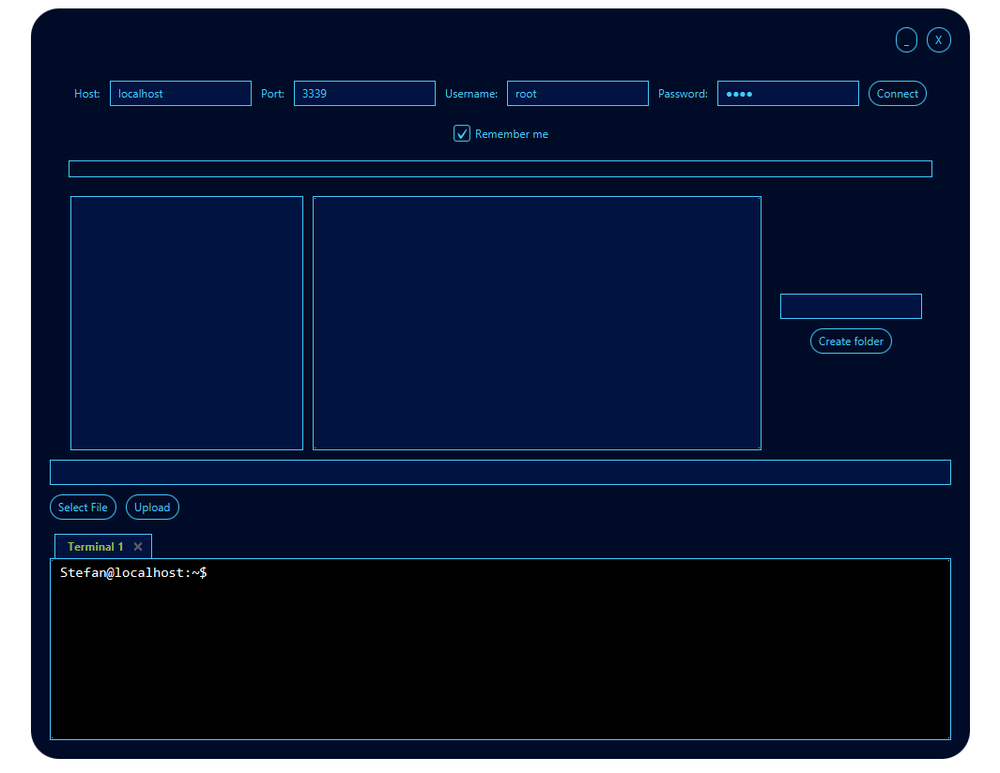
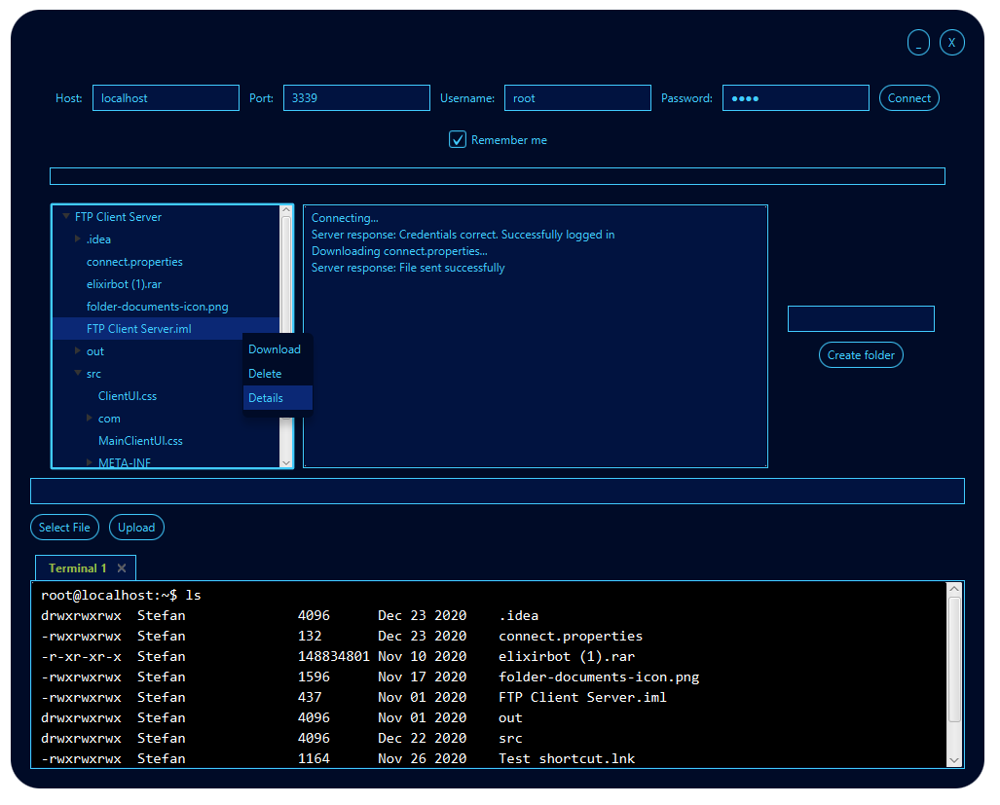

# 2020_FTP-klijent-server-implementacija

[](https://app.codacy.com/gh/MATF-Computer-Networks-Projects/2020_FTP-klijent-server-implementacija?utm_source=github.com&utm_medium=referral&utm_content=MATF-Computer-Networks-Projects/2020_FTP-klijent-server-implementacija&utm_campaign=Badge_Grade)

Prenos fajlova izmedju klijenata i servera, kreiranje i brisanje foldera i fajlova kao i ostale FTP komande. Implementacija FTP protokola sa prosirenim funkcionalnostima kao na primer AES 128-bit enkripcija umesto standardnog SSL/TLS-a. Komunikacija se vrsi pomocu objekata koji se serijalizuju i enkriptuju, i ako je potrebno salje se ili preuzima fajl koji je takodje enkriptovan radi sprecavanja kradje podataka. Kljuc za enrkripciju se generise nakon konekcije na server, i nakon toga klijent salje svoje ime i sifru. Korisnicki interfejs je implementiran samo na klijentskoj strani, takodje sadrzi UNIX-style terminal za direktno izvrsavanje FTP komandi.

## Implementacija i zahtevi za pokretanje servera/klijenta
- Projekat je pisan u Javi i za pokretanje je neophodno imati jre 9.0.4 ili noviju verziju. Nisu potrebne dodatne biblioteke.<br/><br/>

## Kompatibilnost
- Program je kompatibilan i sa Windows i sa GNU/Linux operativnim sistemom. Kod je pisan na Windows operativnom sistemu. 

## Pokretanje servera i klijenta

Server se pokrece tako sto se kao argument prosledi port na kome ce server raditi:
```
java -jar Server.jar port
```
To ce pokrenuti server na trenutnoj lokaciji ```jar``` fajla, sto ce ujedno biti root folder servera. Server ne sadrzi korisnicki interfejs. Klijent se pokrece bez dodatnih argumenata:
```
java -jar Client.jar
```
Nakon pokretanja pojavice se korisnicki interfejs. Moguce je izvrsavati komande i putem terminala koji sadrzi osnovne FTP i UNIX komande.<br/><br/><br/><br/>


## Korisnicki interfejs

Klijentski korisnicki interfejs se sastoji od polja za povezivanje, log, upload, pravljenje novog foldera, file explorer-a kao i UNIX terminala



Nakon uspesne konekcije ucitava se file explorer sa folderima i fajlovima na serveru. Desni klik na fajl/folder otvara meni pomocu koga mozemo da skinemo fajl, da ga obrisemo i da vidimo detalje. Pravljenje novog foldera se vrsi unosenjem imena na desnoj strani i biranja lokacije gde ce se folder kreirati. Upload se vrsi tako sto se izabere fajl sa lokalnog racunara i biranjem lokacije na serveru gde ce se fajl nalaziti.


